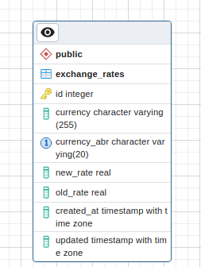

# Currency Exchange Tracking Application

This application is the backend of a currency exchange tracker built using python flask. 
database used is postgres. All additional libraries are included in `requirements.txt`.

### Setup
Clone the repository to your local system and install `requirements.txt` using:</br>
`pip install -r requirements.txt` </br></br>Then move to create a database. Install postgres sql on your local
system. Create a database by the name "exchange_rates". Then on your terminal open 
python shell using the command: `python`.
Copy/paste this code to your terminal: </br>
```commandline
from main import app
from src.models.exchange_rate_model import db
with app.app_context():
  db.drop_all()
  db.create_all()
```

</br>This will create the needed schema in your db.</br>
You can run the application from the terminal by using the command:`python main.py`. This will run
your application on `localhost:5000/`. 

### Api
The system has 2 main API's and one scheduled API. </br>
First API shows the user the current exchange rates. Use this URL in your browser to 
see the response: </br>
`http://localhost:5000/exchange_rates` </br>
A sample response: <br>
```commandline
[
  {
    "created_at": "Mon, 17 Jul 2023 16:01:24 GMT",
    "currency": "US dollar",
    "currency_abr": "USD",
    "id": 5,
    "rate": 1.123,
    "updated": "Mon, 17 Jul 2023 17:21:05 GMT"
  },
  {
    "created_at": "Mon, 17 Jul 2023 16:01:24 GMT",
    "currency": "Japanese yen",
    "currency_abr": "JPY",
    "id": 6,
    "rate": 155.38,
    "updated": "Mon, 17 Jul 2023 17:21:05 GMT"
  },
  {
    "created_at": "Mon, 17 Jul 2023 16:01:24 GMT",
    "currency": "Bulgarian lev",
    "currency_abr": "BGN",
    "id": 7,
    "rate": 1.9558,
    "updated": "Mon, 17 Jul 2023 17:21:05 GMT"
  },
  {
    "created_at": "Mon, 17 Jul 2023 16:01:24 GMT",
    "currency": "Pound sterling",
    "currency_abr": "GBP",
    "id": 10,
    "rate": 0.85873,
    "updated": "Mon, 17 Jul 2023 17:21:05 GMT"
  },
  {
    "created_at": "Mon, 17 Jul 2023 16:01:24 GMT",
    "currency": "Hungarian forint",
    "currency_abr": "HUF",
    "id": 11,
    "rate": 373.03,
    "updated": "Mon, 17 Jul 2023 17:21:05 GMT"
  }
]

```

The second API shows how the exchange rate has changed compared to the previous day.</br>
`http://localhost:5000/exchange_rates/compare` </br>
A sample response:</br>
```
  {
    "comments": "The currency value has declined.",
    "currency": "US dollar",
    "currency_abr": "USD",
    "rate_today": 1,
    "rate_yesterday": 1.123,
    "updated_at": "Mon, 17 Jul 2023 17:21:05 GMT"
  },
  {
    "comments": "The currency value has improved.",
    "currency": "Japanese yen",
    "currency_abr": "JPY",
    "rate_today": 155.38,
    "rate_yesterday": 155.38,
    "updated_at": "Mon, 17 Jul 2023 17:21:05 GMT"
  },
  {
    "comments": "The currency value has declined.",
    "currency": "Bulgarian lev",
    "currency_abr": "BGN",
    "rate_today": 1.3,
    "rate_yesterday": 1.9558,
    "updated_at": "Mon, 17 Jul 2023 17:21:05 GMT"
  }
 ]
```
Lastly there is a scheduled task that runs every day at 16:00:45 CET time. Because that is when the
currency rates are updated. This will fetch the new data and move the previous rates to the 
`old_rate` section. It is an upsert method meaning if a currency is already in db it will not
add a new one but overwrite the existing data.</br>

### Database
The database contains only one table `exchange_rates`. It has the following schema: </br></br>

</br></br> It has two constraints.
- One for primary key `id`.
- One for unique constraint on currency abr.